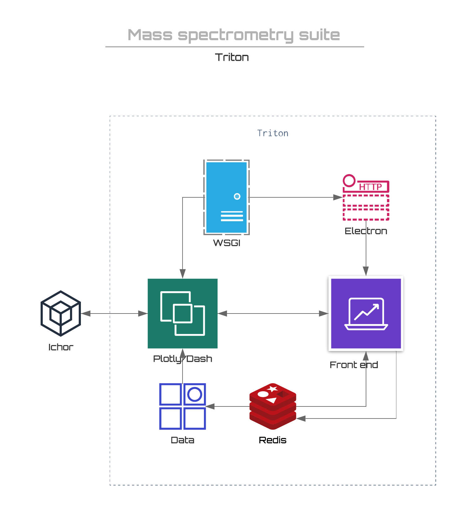

# triton (WIP)

## Introduction

This extends Amphitrite with a client-server architecture graphical interface based on modern web technologies (Electron, Dash, Plotly, Javascript) with a back-end running on Python 3.

The original Amphitrite code-base was ported from Python 2.x to Python 3.x using automated tools as well as manual formatting of the original code (a number of functions have to be re-written in order to sucesfully run in the new environment)

## Structure

IPC Client Server Architecture with a Renderer/Main process and a Flask server to server the front-end.



## Installation

This software is using the `poetry` package manager in order to install the software. That means you only need to install the package and run `poetry install` which will install all the required modules as well as it will create a new environment for the user.

Redis is used for local caching of expensive calculations, in order to free-up the front-end from it. Again developing for Windows is trickier than Unix platforms (Linux, OsX). One needs to install WSL and run:

``` 
sudo apt update
sudo apt upgrade
sudo apt install redis - server

# Check you 're on the latest version
redis - cli - v

# Restart the server to ensure it 's up
sudo service redis - server restart

redis - cli
```

For Windows you can install waitress and run `waitress-serve.exe --listen=*:5000 --threads=` nproc ` amphitrite:app.server` and replace the port and threads with the ones of your choice.

## How to run

Start the virtual environment that you created previously and run `cd ichor ; python3 triton.py` in order to create a server process that will provide a local server on a predefined port (5000 by default but that can be changed). 

When this is sucesfull the Electron part of the application can be started by running `electron .` which will install the respective `node_modules` and run the front-end.

_Note_: You need to save the data files inside `ichor/data` folder for the front-end to properly operate. This is going to be changed in future versions.

Alternatively a WSGI client can be used such as `waitress-serve` for Windows in the production.

# Copyright

If you use this software or any part of it please add a citation to the following DOI
[](https://zenodo.org/badge/latestdoi/180900436)

Thank you :) 
